# Multicloud-DevOps-AI-Bootcamp
     
# Situação     
     
Este projeto tem como objetivo simular um cenário real em que uma empresa, ao perceber que seu concorrente está oferecendo preços mais competitivos, busca maneiras de reduzir seus custos para se manter competitiva no mercado.    
     
Uma das soluções  encontradas foi diminuir o custo de __Suporte ao Cliente__, pois os gastos mensais com folha de pagamento estavam em __R$ 2,5 milhões__. Com a aplicação da solução apresentada abaixo, estima-se que o custo mensal cairá para __R$ 250 mil__, resultando em uma __diminuição de R$ 2,25 milhões nos custos operacionais__, o que impactará no custo final do produto, tornando-o mais competitivo.
     
# Solução     
     
Para obtermos esse retorno, será necessário rearquitetar e migrar a aplicação para rodar de forma moderna na nuvem com DevOps integrada com Assistentes de IA.
     
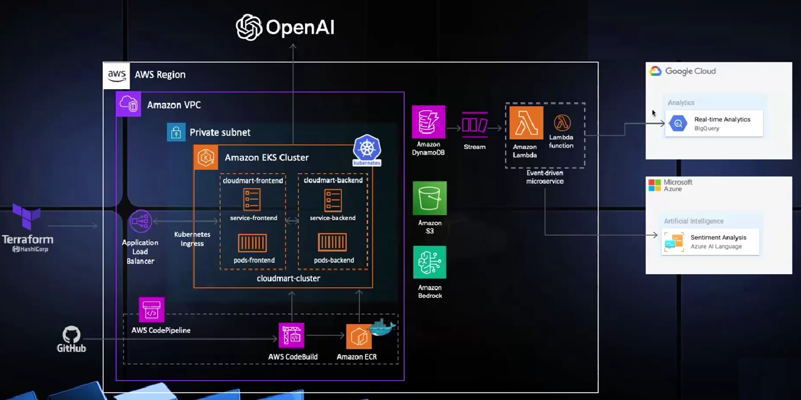
    
    
# Dia 1
     
## Preparação de ambiente
    
Para esse desafio, estaremos utilizando um ambiente em núvem, dentro de uma instância EC2 da AWS. Os primeiros passos serão a configuração desse ambiente.
    
1. Criar de uma 'Role' para o EC2.
2. Lançar a instância EC2
3. Conectar à instância
    
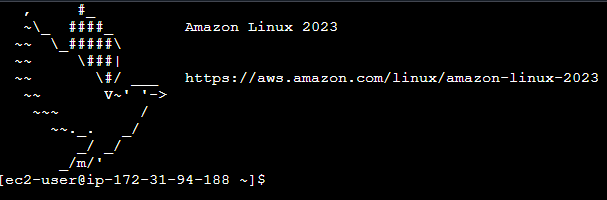
     
Agora vamos configurar o ambiente fazendo as instalações necessárias
     
```bash
sudo yum update -y
sudo yum install -y yum-utils

sudo yum-config-manager --add-repo https://rpm.releases.hashicorp.com/AmazonLinux/hashicorp.repo

sudo yum -y install terraform
``` 
     
## Iniciando com Terraform
     
Para dar os primeiros passos com _Terraform_ criei o primeiro arquivo que faz a criação de um bucket S3. Também tive o primeiro contato com os principais comandos:
     
```bash
#Inicialize o Terraform
terraform init

#Revise o plano
terraform plan

# Aplica a configuração
terraform apply

# Comando para destruir os recursos recem criados
terraform destroy
```
      
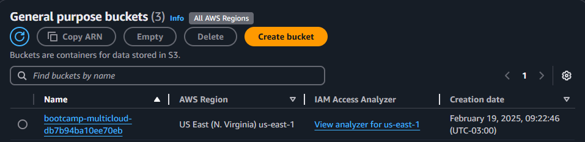
     

# Dia 2
     
## Criação de Tabelas no _DynamoDB_
      
Logo no início do segundo dia, já consegui perceber o poder e a velocidade do Terraform para provisionar recursos na nuvem.

Alterei o arquivo de configuração para criar três tabelas no _DynamoDB_, e o processo levou apenas alguns segundos para ser concluído. O que mais me impressionou foi a escalabilidade, pois, como a criação das tabelas foi realizada em paralelo, isso significa que, mesmo se fosse necessário criar 100 tabelas, o tempo teóricamente para a execução seria o mesmo ou próximo desse.
     
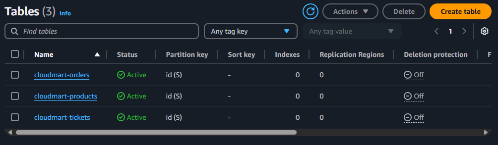
          
## Preparando o Docker
     
Para iniciar com o Docker, primeiro realizei os comandos de instalação e configuração.
     
```bash
sudo yum update -y
sudo yum install docker -y

sudo systemctl start docker
sudo systemctl enable docker

sudo usermod -a -G docker $(whoami)
newgrp docker
```
     
## Configurando Backend

Com o Docker instalado, podemos baixar a imagem do _CloudMart_ e configurar o container do _backend_.

```bash
mkdir backend && cd backend

wget https://tcb-public-events.s3.amazonaws.com/mdac/resources/day2/cloudmart-backend.zip
unzip cloudmart-backend.zip

nano .env

# PORT=5000
# AWS_REGION=us-east-1

nano Dockerfile

# FROM node:18
# WORKDIR /usr/src/app
# COPY package*.json ./
# RUN npm install
# COPY . .
# EXPOSE 5000
# CMD ["npm", "start"]

docker build -t cloudmart-backend .
docker run -d -p 5000:5000 --env-file .env cloudmart-backend
```     
            
## Configurando Frontend
      
Agora criaremos também a imagem para rodar o Frontend da aplicação.
      
```bash
mkdir frontend && cd frontend

wget https://tcb-public-events.s3.amazonaws.com/mdac/resources/day2/cloudmart-frontend.zip
unzip cloudmart-frontend.zip

nano .env

# VITE_API_BASE_URL=http://<seu-ip-ec2>:5000/api

nano Dockerfile

# FROM node:16-alpine as build
# WORKDIR /app
# COPY package*.json ./
# RUN npm ci
# COPY . .
# RUN npm run build

# FROM node:16-alpine
# WORKDIR /app
# RUN npm install -g serve
# COPY --from=build /app/dist /app
# ENV PORT=5001
# ENV NODE_ENV=production
# EXPOSE 5001
# CMD ["serve", "-s", ".", "-l", "5001"]

docker build -t cloudmart-frontend .
docker run -d -p 5001:5001 cloudmart-frontend
```
     
>Precisei também liberar as portas 5000 e 5001 no security group para conseguir acessar a aplicação
     
A Aplicação ficou disponível no link 'http://{ip-publico-ec2}:5001' e para cadastrar produtos basta entrar na parte de administrador 'http://{ip-publico-ec2}5001/admin'.
      
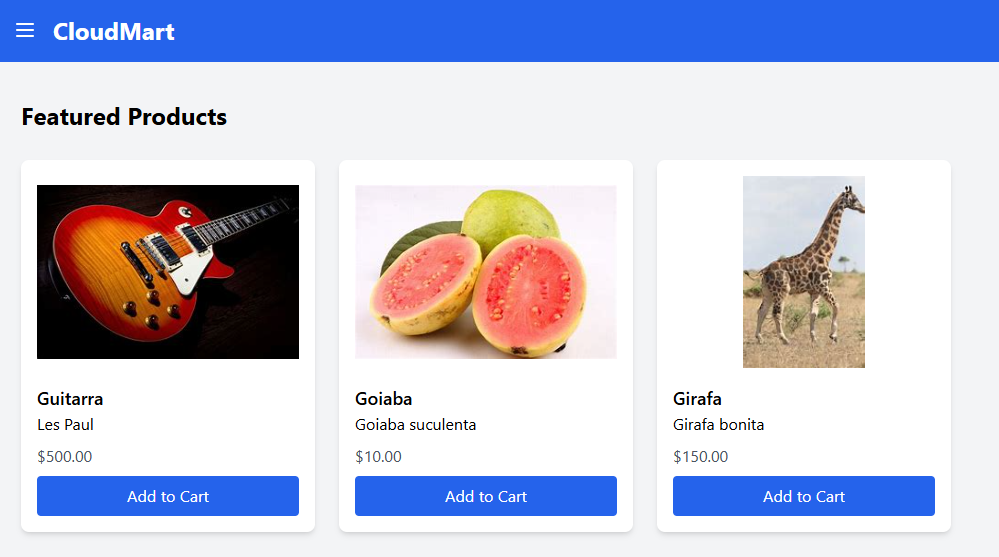
     

# Dia 3 - Parte 1
     
## Kubernetes Configurações iniciais
     
Hoje iremos iniciar a utilização do kubernetes, acessando atravéz do serviço Amazon EKS, esse serviço é pago e deve-se ter muita atenção ao utilizá-lo para não esquece-lo aberto.
     
Primeiro eu criei um novo usuário IAM chamado 'eksuser' e depois dentro da minha instância EC2 segui os seguintes passos:
     
```bash
# Acessei o usuário eksuser
aws configure

# Instala ferramenta eksctl
curl --silent --location "https://github.com/weaveworks/eksctl/releases/latest/download/eksctl_$(uname -s)_amd64.tar.gz" | tar xz -C /tmp
sudo cp /tmp/eksctl /usr/bin
eksctl version

# Instala ferramenta kubectl
curl -o kubectl https://amazon-eks.s3.us-west-2.amazonaws.com/1.18.9/2020-11-02/bin/linux/amd64/kubectl
chmod +x ./kubectl
mkdir -p $HOME/bin && cp ./kubectl $HOME/bin/kubectl && export PATH=$PATH:$HOME/bin
echo 'export PATH=$PATH:$HOME/bin' >> ~/.bashrc
kubectl version --short --client

# Cria Cluster Kubernetes
eksctl create cluster \
  --name cloudmart \
  --region us-east-1 \
  --nodegroup-name standard-workers \
  --node-type t3.medium \
  --nodes 1 \
  --with-oidc \
  --managed
```
    
Após o último comando, irá iniciar algumas stacks do CloudFomation, pois é atravéz dele que são criados todos os recursos necessários do EKS.
     
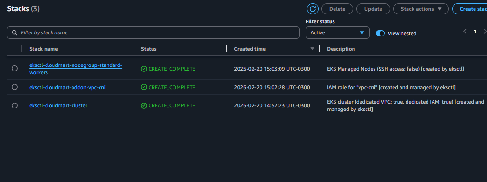
     

## Kubernetes primeiros passos
     
Agora que temos nosso cluster kubernetes ativo, podemos iniciar com os primeiros comandos.
      
```bash
# Conecta ao cluster
aws eks update-kubeconfig --name cloudmart

# Verifica conectividade do Cluster
kubectl get svc
kubectl get nodes

# Dá permissão (atravéz de Role) ao cluster para acessar outros serviços AWS
eksctl create iamserviceaccount \
  --cluster=cloudmart \
  --name=cloudmart-pod-execution-role \
  --role-name CloudMartPodExecutionRole \
  --attach-policy-arn=arn:aws:iam::aws:policy/AdministratorAccess\
  --region us-east-1 \
  --approve
```
     
Agora precisamos registrar as imagens do Backend e do Frontend no ECR. Para isso seguimos os seguintes passos:
      
1- Abra o serviço ECS no console AWS
2- Vá na parte de repositórios publicos
3- Crie um novo repositório (cloudmart-backend e cloudmart-frontend)
4- Clique no repositório de depois em 'View Push Commands', e faça, dentro da instância, os comandos apresentados
      
## Deployment do Backend no Kubernetes
      
```bash
# Entre na pasta do backend
cd backend

# Cria um novo deployment do Kubernetes no arquivo yaml
nano cloudmart-backend.yaml

# Realiza o Deployment do Backend no Kubernetes
kubectl apply -f cloudmart-backend.yaml

# Comandos para acompanhar a criação dos objetos
kubectl get pods
kubectl get deployment
kubectl get service # Lembre-se de copiar o IP Público para usar no .env do Frontend
```
       
## Deployment do Frontend no Kubernetes
      
```bash
# Entre na pasta do frontend
cd frontend

# Edita o arquivo .env
nano .env

# VITE_API_BASE_URL=http://a75602f93a86f47ca977bae4e78d0cde-1631225860.us-east-1.elb.amazonaws.com:5000/api

# Cria um novo deployment do Kubernetes no arquivo yaml
nano cloudmart-frontend.yaml

# Realiza o Deployment do frontend no Kubernetes
kubectl apply -f cloudmart-frontend.yaml
```
     
E pronto, temos a aplicação rodando dentro dos containeres orquestrados pelo EKS, agora para não gerar cobranças exessivas vamos fazer a limpeza do ambiente.
      
```bash
kubectl delete service cloudmart-frontend-app-service
kubectl delete deployment cloudmart-frontend-app
kubectl delete service cloudmart-backend-app-service
kubectl delete deployment cloudmart-backend-app

eksctl delete cluster --name cloudmart --region us-east-1
```
      
# Dia 3 - Parte 2
      
## Configurando Pipeline CI/CD
     
Para essa etapa continuaremos rodando a aplicação dentro do Kubernetes, porém faremos uma esteira de CI/CD para a parte de Frontend para que todas as mudanças feitas no código e atualizadas no repositório github sejam refletidas na aplicação em produção de forma continua.
      
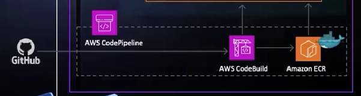
      
>Como a pipeline CI/CD será aplicada somente na parte de frontend do projeto, subi um novo repositório no Github contendo o código fonte somente do front num repositório >chamado __Cloudmart__.     

## AWS CodePipeline   
     
Para configurar o _CodePipeline_ segui os seguintes passos:    
     
1- No console cliquei no botão __Create new Pipeline__ .          
2- Selecionei a opção __Build Custom Pipeline__.   
       
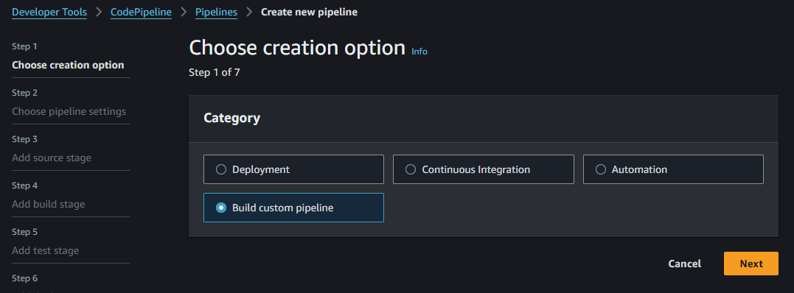     
      
3- Nomeei a pipeline como: __cloudmart-cicd-pipeline__.     
4- Conectei meu repositório Github seguindo os passos do console.      
       
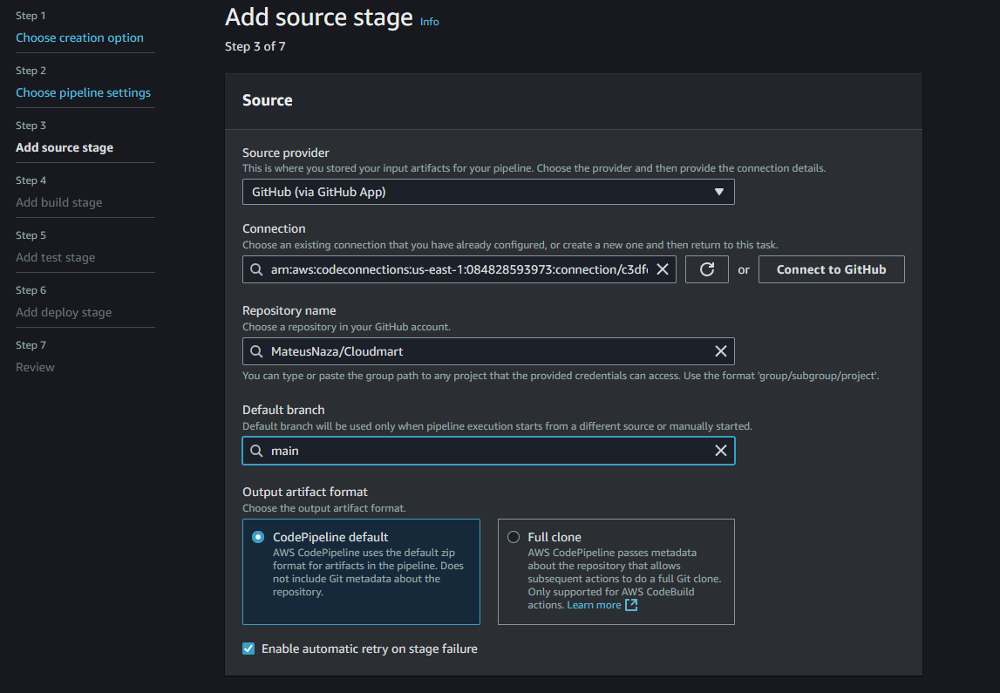     
     
5- Configurei a etapa de build para utilizar o __CodeBuild__ e já cliquei para criar um projeto dentro desse serviço.     
      
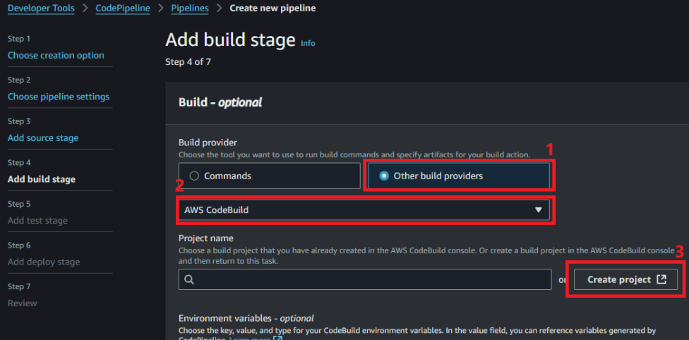     
     
6- Na aba __CodeBuild__, nomeeio meu projeto de __cloudmart-application__ e fiz as seguintes alterações.     
     
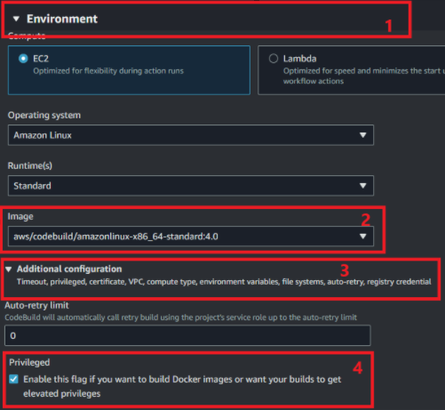     
      
7- Ainda nessa guia, adicionei uma variáveu de ambiente com: KEY=ECR_REPO e VALUE=URI-do-Repositório-ECR.     
8- Criei uma _buildspec.yaml_ com o seguinte conteúdo.     
      
```bash
version: 0.2
phases:
  install:
    runtime-versions:
      docker: 20
  pre_build:
    commands:
      - echo Logging in to Amazon ECR...
      - aws --version
      - REPOSITORY_URI=$ECR_REPO
      - aws ecr-public get-login-password --region us-east-1 | docker login --username AWS --password-stdin public.ecr.aws/r2l2v5m8
  build:
    commands:
      - echo Build started on `date`
      - echo Building the Docker image...
      - docker build -t $REPOSITORY_URI:latest .
      - docker tag $REPOSITORY_URI:latest $REPOSITORY_URI:$CODEBUILD_RESOLVED_SOURCE_VERSION
  post_build:
    commands:
      - echo Build completed on `date`
      - echo Pushing the Docker image...
      - docker push $REPOSITORY_URI:latest
      - docker push $REPOSITORY_URI:$CODEBUILD_RESOLVED_SOURCE_VERSION
      - export imageTag=$CODEBUILD_RESOLVED_SOURCE_VERSION
      - printf '[{\"name\":\"cloudmart-app\",\"imageUri\":\"%s\"}]' $REPOSITORY_URI:$imageTag > imagedefinitions.json
      - cat imagedefinitions.json
      - ls -l

env:
  exported-variables: ["imageTag"]

artifacts:
  files:
    - imagedefinitions.json
    - cloudmart-frontend.yaml
```
      

E pronto, após esse comando criamos nossa pipeline.
     
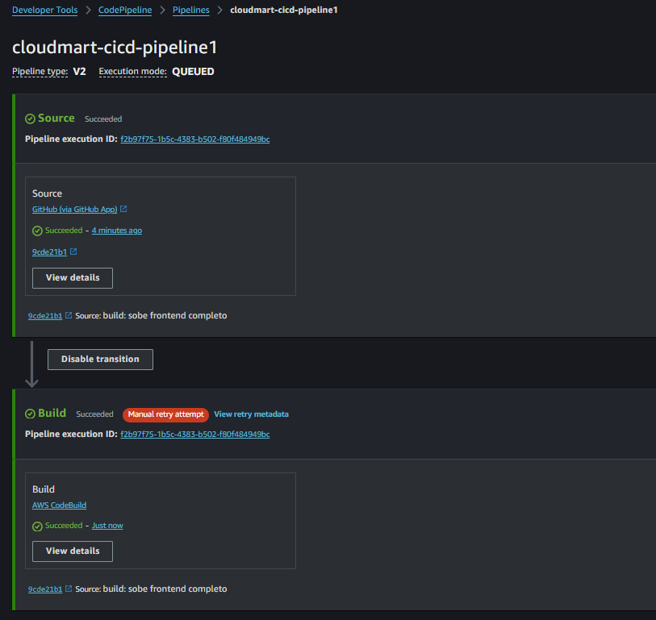    
     

> Detalhe importante!!!
> Deve-se dar a permissão para acessar o ECR para a role 'codebuild...' no IAM
       
## Adicionando processo de Deploy
      
Após concluir a pipeline, adicionei mais um processo a ela, e na ação que inseri criei outro projeto do _CodeBuild_ seguindo os mesmos passos anteriores porém com as seguintes modificações:     
  - O nome do projeto foi __cloudmartDeployToProduction__.
  - Coloquei de variáveis de ambiente a AWS_ACCESS_KEY_ID e AWS_SECRET_ACCESS_KEY.
       
Para o _buildspec.yaml_ desse arquivo vamos usar o seguinte código:      
```bash
version: 0.2

phases:
  install:
    runtime-versions:
      docker: 20
    commands:
      - curl -o kubectl https://amazon-eks.s3.us-west-2.amazonaws.com/1.18.9/2020-11-02/bin/linux/amd64/kubectl
      - chmod +x ./kubectl
      - mv ./kubectl /usr/local/bin
      - kubectl version --short --client
  post_build:
    commands:
      - aws eks update-kubeconfig --region us-east-1 --name cloudmart
      - kubectl get nodes
      - ls
      - IMAGE_URI=$(jq -r '.[0].imageUri' imagedefinitions.json)
      - echo $IMAGE_URI
      - sed -i "s|CONTAINER_IMAGE|$IMAGE_URI|g" cloudmart-frontend.yaml
      - kubectl apply -f cloudmart-frontend.yaml
```
       
## Edição de arquivo .yaml no github     
       
A útima configuração foi apenas alterar o caminho da imagem pela variável CONTAINER_IMAGE dentro do meu arquivo '.yaml' no repositório git do projeto. Após fazer o push dessa alteração o meu pipeline foi automaticamente acionado e efetuado todo o processo automático de deploy da alteração.      
       
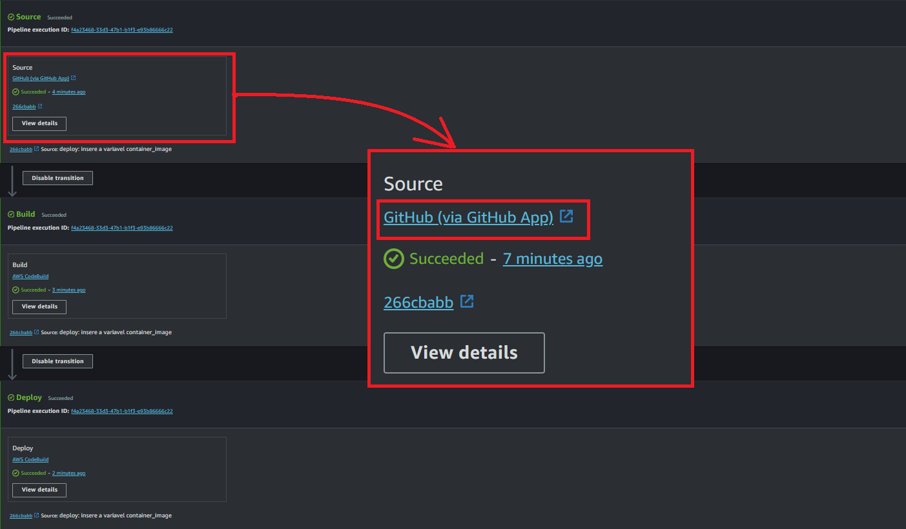     
     
## Testando alterações e subindo para produção
      
Vou fazer um teste simples alterando um texto para verificar se as alterações estão subindo para produção como deveriam.
     
### Antes da alteração

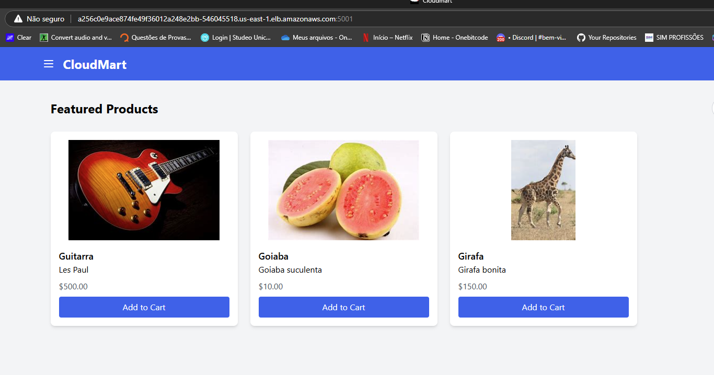

Somente alterei um texto e dei o push do repositório na branch main...
       
### Depois da Alteração
      
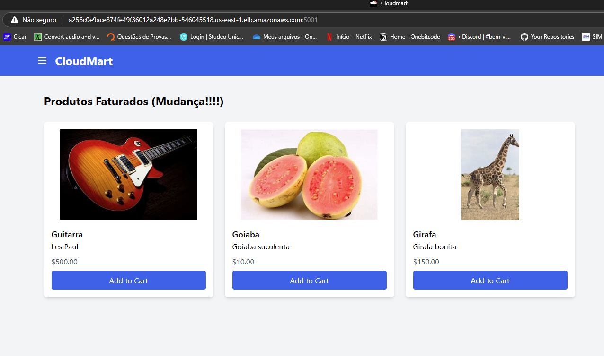
       

# Dia 4
          
## Criação da infraestrutura base para o Bedrock
          
O modelo de IA do meu projeto precisará conectar aos dados dos produtos do site, para isso precisarei criar uma função lambda na AWS que faz uma requisição na lista de produtos que contém dentro da CloudMart.
        
1- Peguei o arquivo '*list_products.zip*' que estava dentro da 'backend/src/lambda' e transferi ele para a minha pasta 'terraform-project'.
2- Acrescentei o seguinte código ao meu '_main.tf_'.
         
```bash
# IAM Role for Lambda function
resource "aws_iam_role" "lambda_role" {
  name = "cloudmart_lambda_role"

  assume_role_policy = jsonencode({
    Version = "2012-10-17"
    Statement = [
      {
        Action = "sts:AssumeRole"
        Effect = "Allow"
        Principal = {
          Service = "lambda.amazonaws.com"
        }
      }
    ]
  })
}

# IAM Policy for Lambda function
resource "aws_iam_role_policy" "lambda_policy" {
  name = "cloudmart_lambda_policy"
  role = aws_iam_role.lambda_role.id

  policy = jsonencode({
    Version = "2012-10-17"
    Statement = [
      {
        Effect = "Allow"
        Action = [
          "dynamodb:Scan",
          "logs:CreateLogGroup",
          "logs:CreateLogStream",
          "logs:PutLogEvents"
        ]
        Resource = [
          aws_dynamodb_table.cloudmart_products.arn,
          aws_dynamodb_table.cloudmart_orders.arn,
          aws_dynamodb_table.cloudmart_tickets.arn,
          "arn:aws:logs:*:*:*"
        ]
      }
    ]
  })
}

# Lambda function for listing products
resource "aws_lambda_function" "list_products" {
  filename         = "list_products.zip"
  function_name    = "cloudmart-list-products"
  role             = aws_iam_role.lambda_role.arn
  handler          = "index.handler"
  runtime          = "nodejs20.x"
  source_code_hash = filebase64sha256("list_products.zip")

  environment {
    variables = {
      PRODUCTS_TABLE = aws_dynamodb_table.cloudmart_products.name
    }
  }
}

# Lambda permission for Bedrock
resource "aws_lambda_permission" "allow_bedrock" {
  statement_id  = "AllowBedrockInvoke"
  action        = "lambda:InvokeFunction"
  function_name = aws_lambda_function.list_products.function_name
  principal     = "bedrock.amazonaws.com"
}

# Output the ARN of the Lambda function
output "list_products_function_arn" {
  value = aws_lambda_function.list_products.arn
}
```
      
3- Rodei os comandos Terraform para efetuar a criação.
          
```bash
terraform init
terraform plan
terraform apply
```
      
## Iniciando com o Amazon Bedrock
       
Para o agente de IA, fiz a solicitação dentro do Amazon Bedrock para utilizar o modelo Claude Sonnet. Foi bem simples de fazer a requisição, bastou preencher alguns campos e em 1 ou 2 minutos já foi liberado o acesso.    
      
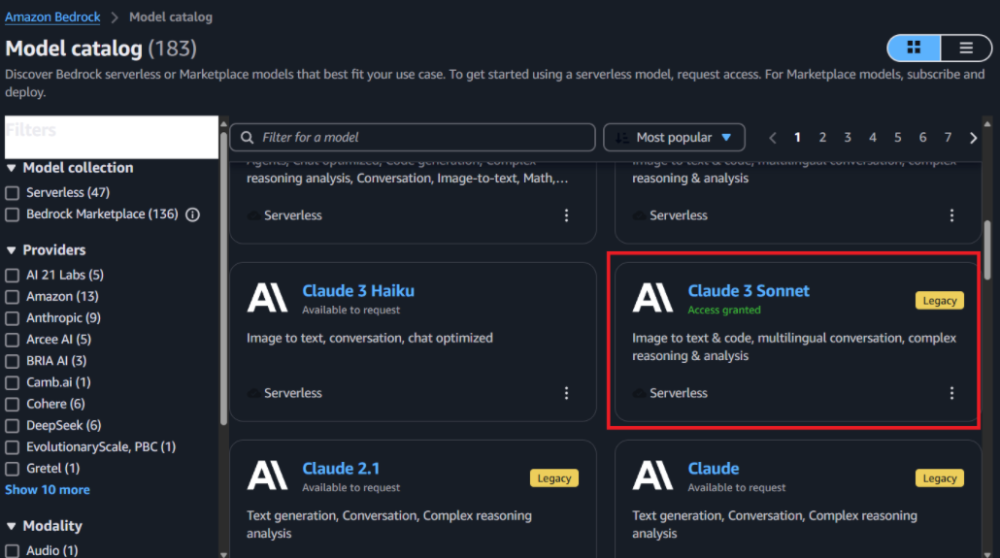
        
## Criação do agente 
     
Ainda no console do Bedrock, fui na parte de agentes e segui os seguintes passos.
      
1- Cliquei em "Create Agent" e nomeei o agente de "cloudmart-product-recommendation-agent".     
2- Selecionei o modelo "Claude Sonnet 3" como modelo base.        
3- Coloquei o seguinte prompt para o modelo.       
          
```bash
You are a product recommendations agent for CloudMart, an online e-commerce store. Your role is to assist customers in finding products that best suit their needs. Follow these instructions carefully:

1. Begin each interaction by retrieving the full list of products from the API. This will inform you of the available products and their details.

2. Your goal is to help users find suitable products based on their requirements. Ask questions to understand their needs and preferences if they're not clear from the user's initial input.

3. Use the 'name' parameter to filter products when appropriate. Do not use or mention any other filter parameters that are not part of the API.

4. Always base your product suggestions solely on the information returned by the API. Never recommend or mention products that are not in the API response.

5. When suggesting products, provide the name, description, and price as returned by the API. Do not invent or modify any product details.

6. If the user's request doesn't match any available products, politely inform them that we don't currently have such products and offer alternatives from the available list.

7. Be conversational and friendly, but focus on helping the user find suitable products efficiently.

8. Do not mention the API, database, or any technical aspects of how you retrieve the information. Present yourself as a knowledgeable sales assistant.

9. If you're unsure about a product's availability or details, always check with the API rather than making assumptions.

10. If the user asks about product features or comparisons, use only the information provided in the product descriptions from the API.

11. Be prepared to assist with a wide range of product inquiries, as our e-commerce store may carry various types of items.

12. If a user is looking for a specific type of product, use the 'name' parameter to search for relevant items, but be aware that this may not capture all categories or types of products.

Remember, your primary goal is to help users find the best products for their needs from what's available in our store. Be helpful, informative, and always base your recommendations on the actual product data provided by the API.
```
      
4- Após concluir a criação do agent, surge uma nova role cujo link pode ser visualizado na própria tela do Bedrock, acessei a minha role em outra aba e atribui as seguintes permissões para ela. (Nomeei essa política inline de "BedrockAgentLambdaAccess")         
          
```bash
{
  "Version": "2012-10-17",
  "Statement": [
    {
      "Effect": "Allow",
      "Action": "lambda:InvokeFunction",
      "Resource": "arn:aws:lambda:*:*:function:cloudmart-list-products"
    },
    {
      "Effect": "Allow",
      "Action": "bedrock:InvokeModel",
      "Resource": "arn:aws:bedrock:*::foundation-model/anthropic.claude-3-sonnet-20240229-v1:0"
    }
  ]
}
```
       
## Configuração do Action Group
          
Para que o agente consiga se comunicar com o banco de dados do DynamoDB atravéz da nossa lambda function, precisamos configurar essa ação atravéz do action group.
      
1- Cliquei em editar meu agente, naveguei até a parte de action group, cliquei em adicionar um novo e nomeei de "Get-Product-Recommendations".         
2- Selecionei a opção "Define with API schemas" e selecionei a lambda function.        
3- Defini o seguinte in-line schema.    
        
```bash
{
    "openapi": "3.0.0",
    "info": {
        "title": "Product Details API",
        "version": "1.0.0",
        "description": "This API retrieves product information. Filtering parameters are passed as query strings. If query strings are empty, it performs a full scan and retrieves the full product list."
    },
    "paths": {
        "/products": {
            "get": {
                "summary": "Retrieve product details",
                "description": "Retrieves a list of products based on the provided query string parameters. If no parameters are provided, it returns the full list of products.",
                "parameters": [
                    {
                        "name": "name",
                        "in": "query",
                        "description": "Retrieve details for a specific product by name",
                        "schema": {
                            "type": "string"
                        }
                    }
                ],
                "responses": {
                    "200": {
                        "description": "Successful response",
                        "content": {
                            "application/json": {
                                "schema": {
                                    "type": "array",
                                    "items": {
                                        "type": "object",
                                        "properties": {
                                            "name": {
                                                "type": "string"
                                            },
                                            "description": {
                                                "type": "string"
                                            },
                                            "price": {
                                                "type": "number"
                                            }
                                        }
                                    }
                                }
                            }
                        }
                    },
                    "500": {
                        "description": "Internal Server Error",
                        "content": {
                            "application/json": {
                                "schema": {
                                    "$ref": "#/components/schemas/ErrorResponse"
                                }
                            }
                        }
                    }
                }
            }
        }
    },
    "components": {
        "schemas": {
            "ErrorResponse": {
                "type": "object",
                "properties": {
                    "error": {
                        "type": "string",
                        "description": "Error message"
                    }
                },
                "required": [
                    "error"
                ]
            }
        }
    }
}
```
        
Após essas configurações, preparei e testei o modelo, que me retornou os produtos cadastrados da CloudMart.       
      
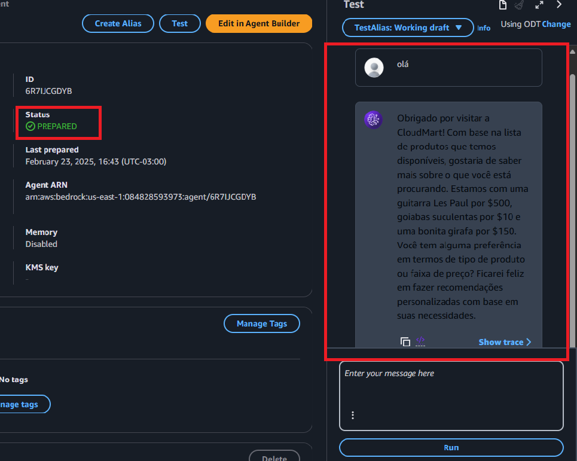       
        
> Criei também um Alias para o meu agente
> Alias: cloudmart-prod
      
## Configuração do Assistente OpenAI
      
Configurarei também um assistente da OpenAI para lidar com o suporte, inclusive realizando cancelamento de pedidos sozinho.    
         
1- Acessei a plataforma da OpenAI e realizei o cadastro e adicionei 5 dolares de crédito https://platform.openai.com/        
2- Crei um novo assistente chamado "CloudMart Customer Support" utilizando o modelo gpt-4o.     
3- Para o prompt de instruções utilizei o seguinte.     
       
```bash
Você é um agente de suporte ao cliente para CloudMart, uma plataforma de e-commerce. Seu papel é auxiliar os clientes com consultas gerais, problemas de pedidos e fornecer informações úteis sobre o uso da plataforma CloudMart. Você não tem acesso direto a informações específicas de produtos ou inventário. Seja sempre educado, paciente e foque em fornecer um excelente atendimento ao cliente. Se um cliente perguntar sobre produtos específicos ou inventário, explique educadamente que você não tem acesso a essas informações e sugira que eles verifiquem o site ou falem com um representante de vendas.
```
        
> Obs.:
> Em "Capabilities", você pode habilitar "Code Interpreter" se quiser que o assistente ajude com aspectos técnicos do uso da plataforma.
         
4- Após concluir o processo, fui para a seção de API Keys e gerei uma nova chave de API.       
       
## Incluindo os Assistentes na aplicação     
       
Para incluir os assistentes de IA na aplicação precisei fazer novamente o deploy do backend, passando dentro do arquivo __.env__ as variáveis de ambiente correspondente aos agentes. Atualizei também no arquivo de construção __.yaml__ e subi novamente utilizando o Kubernetes. ```bash kubernetes apply -f cloudmart-backend.yaml``` 
       
## Testando em produção os assistentes de IA
      
Primeiro testei o assistente de produtos, que trás informação dos produtos e recomendações conforme a intereção com o cliente.      
        
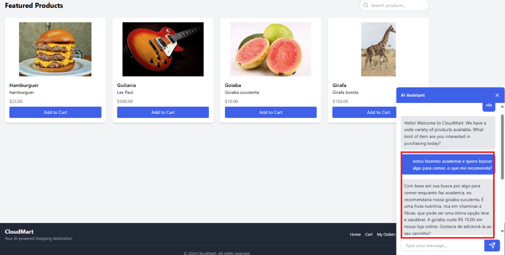
     

     
## Assistente de suporte técnico  
         
Esse assistente é capaz de cancelar produtos que o cliente deseja, ele solicita o ID do produto e faz o cancelamento no sistema.        
        
Vamos supor que o cliente quer cancelar esse pedido:        
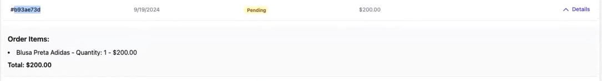               
        
Solicitei ao suporte que queria cancelar o pedido e ele já me solicitou o ID do pedido.       
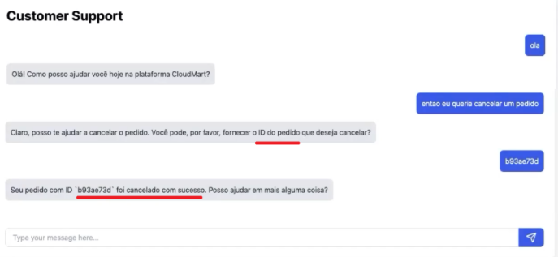       
         
E quando verificamos o pedido foi realmente cancelado!!      
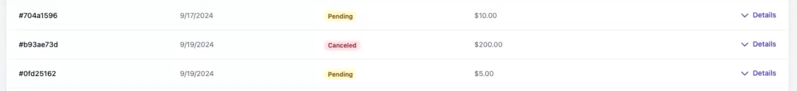